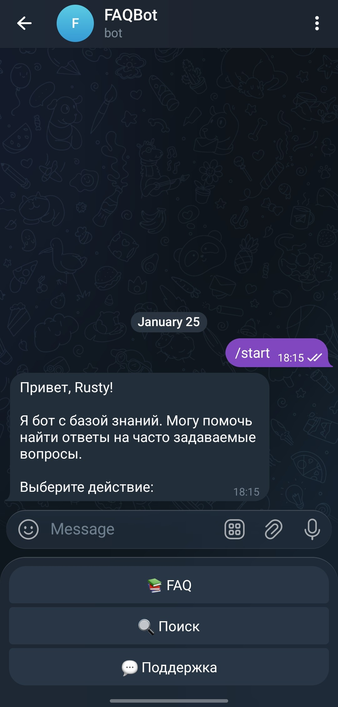
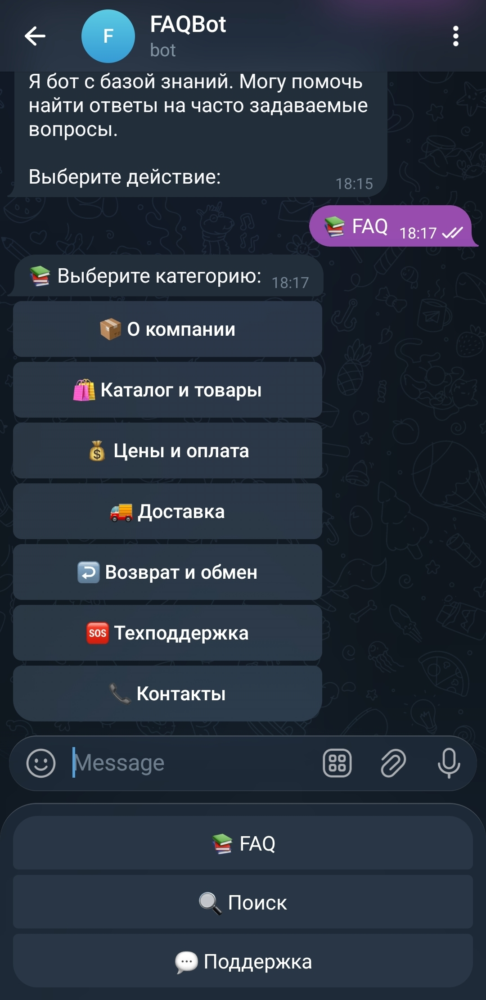
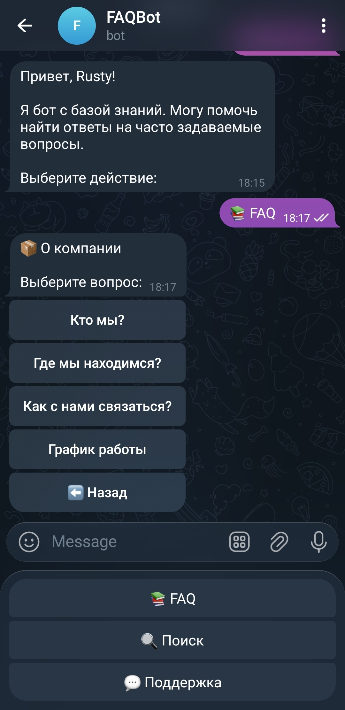
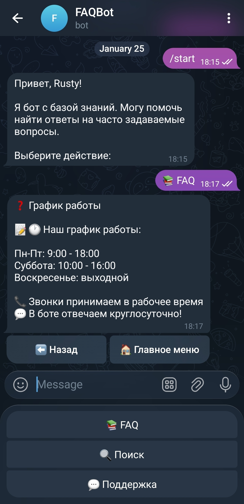
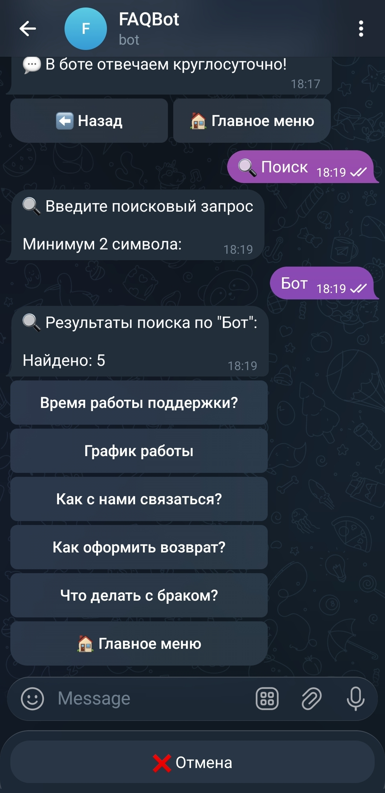
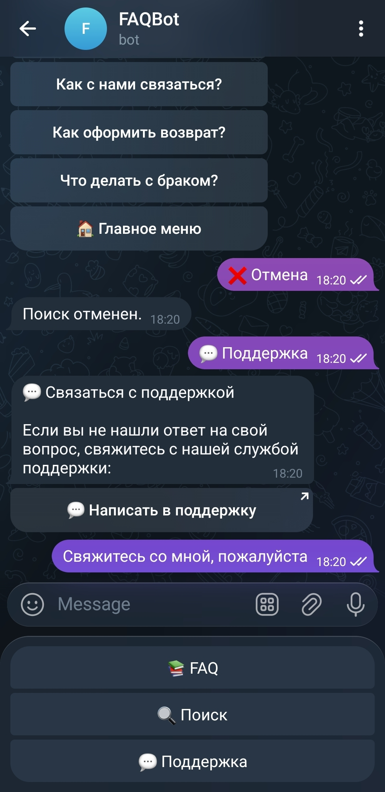
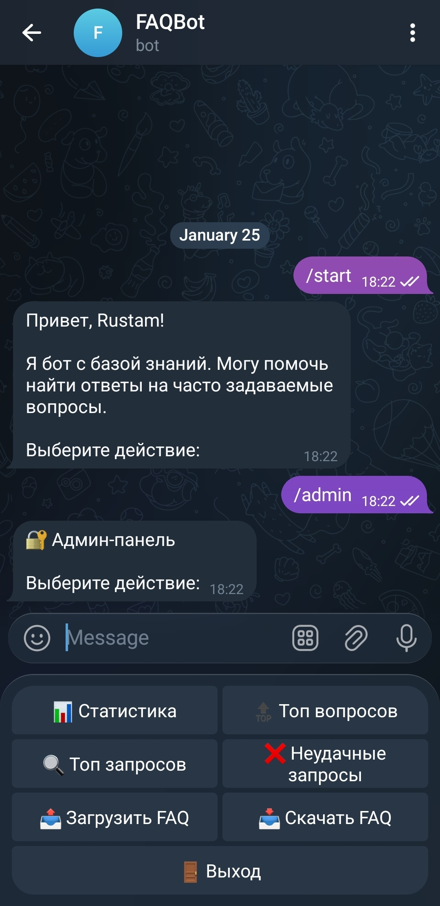
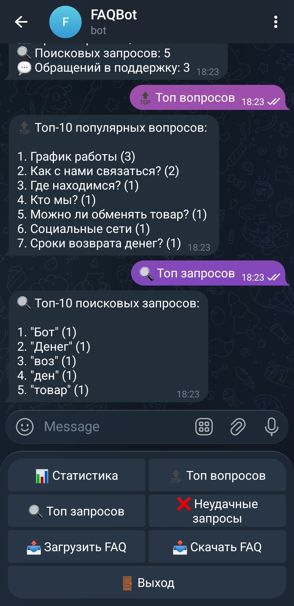
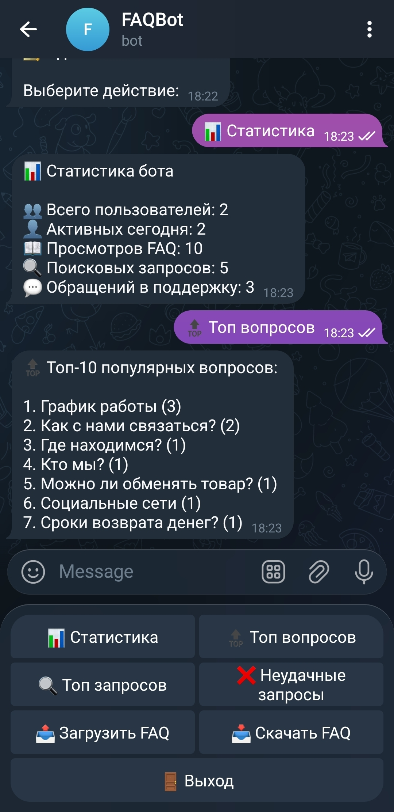

# FaqBot

Умный Telegram-бот для автоматизации ответов на часто задаваемые вопросы с функцией поиска по базе знаний.


## 📋 О проекте

FaqBot — профессиональное решение для бизнеса, которому нужна автоматизация ответов на типовые вопросы клиентов.

**Ключевые особенности:**
- 🔍 **Умный поиск** — находит ответы по ключевым словам во всей базе
- 📤 **Гибкое управление** — загрузка FAQ через JSON файл без изменения кода
- 📊 **Аналитика** — статистика популярных вопросов и поисковых запросов
- 🎯 **Простота использования** — интуитивная навигация по категориям
- ⚙️ **Админ-панель** — полный контроль над FAQ и статистикой

**Целевая аудитория:** Малый и средний бизнес, службы поддержки, стартапы

## ✨ Возможности

### Для пользователей:

- 📋 Навигация по категориям FAQ
- 🔎 Поиск по ключевым словам во всей базе знаний
- 📞 Быстрая связь с поддержкой
- ⬅️ Удобные кнопки "Назад" и "Главное меню"
- 💬 Дружелюбный интерфейс с эмодзи

### Для администратора:

- 📤 Загрузка FAQ через JSON файл
- 📋 Просмотр текущей базы знаний
- 💾 Скачивание FAQ для редактирования
- 📊 Детальная статистика:
  - Топ-5 самых популярных вопросов
  - Топ-10 поисковых запросов
  - Количество пользователей
  - Обращения в поддержку

---

## 📸 Скриншоты

### Основной функционал

#### Начало работы



*Команда /start открывает главное меню с доступом к FAQ, поиску и поддержке*

---

#### Навигация по категориям



*7 категорий FAQ для быстрого поиска нужной информации*



*Все вопросы в выбранной категории с удобной навигацией*



*Подробный ответ на вопрос с кнопками навигации*

---

### 🔍 Умный поиск



*Поиск находит ответы по ключевым словам во всей базе FAQ*

---

### 📞 Поддержка



*Быстрая связь с администратором при необходимости*

---

### ⚙️ Админ-панель

#### Главное меню



*Полный контроль над FAQ: загрузка, просмотр, статистика*

---

#### Аналитика



*Статистика самых популярных вопросов для оптимизации FAQ*



*Детальная аналитика: пользователи, запросы, обращения в поддержку*

---

## 🏗️ Структура проекта
```
faq_bot/
├── handlers/
│   ├── __init__.py
│   ├── commands.py      # /start, /help
│   ├── faq.py           # Навигация по FAQ
│   ├── search.py        # Поиск по базе
│   └── admin.py         # Админ-панель
├── keyboards/
│   ├── __init__.py
│   ├── main.py          # Основные клавиатуры
│   ├── search.py        # Клавиатуры поиска
│   └── admin.py         # Клавиатуры админки
├── states/
│   ├── __init__.py
│   └── search.py        # FSM для поиска
├── utils/
│   ├── __init__.py
│   ├── faq_manager.py   # Работа с JSON
│   ├── search.py        # Логика поиска
│   └── stats.py         # Статистика
├── data/
│   ├── faq.json         # База знаний
│   └── stats.db         # SQLite статистика
├── screenshots/         # Скриншоты для демо
├── config.py            # Конфигурация
├── main.py              # Точка входа
├── .env.example
├── requirements.txt
├── .gitignore
└── README.md
```

## 📦 Требования

- Python 3.10+
- Telegram Bot Token (получить у [@BotFather](https://t.me/BotFather))

## 🚀 Установка и запуск

### 1. Клонируйте репозиторий:
```bash
git clone https://github.com/rusty-iron/telegram-bots-portfolio.git
cd telegram-bots-portfolio/projects/faq_bot
```

### 2. Создайте виртуальное окружение:
```bash
python -m venv venv
source venv/bin/activate  # Linux/macOS
# или
venv\Scripts\activate     # Windows
```

### 3. Установите зависимости:
```bash
pip install -r requirements.txt
```

### 4. Настройте переменные окружения:
```bash
cp .env.example .env
```

Отредактируйте `.env`:
```env
BOT_TOKEN=your_bot_token_here
ADMIN_ID=your_telegram_id
LOG_LEVEL=INFO
```

**Как получить ADMIN_ID:**
- Напишите [@userinfobot](https://t.me/userinfobot)
- Скопируйте ваш ID

### 5. Запустите бота:
```bash
python main.py
```

---

## 📋 Команды бота

| Команда | Описание |
|---------|----------|
| `/start` | Открыть главное меню |
| `/help` | Справка по использованию |
| `/admin` | Админ-панель (только для ADMIN_ID) |

---

## 🔍 Как работает поиск

Бот ищет ключевые слова в:
1. **Вопросах** (высокий приоритет) — точные совпадения
2. **Ответах** (средний приоритет) — контекстный поиск

**Особенности:**
- Регистронезависимый поиск
- Частичное совпадение ("доставк" найдет "доставка", "доставку")
- Сортировка по релевантности
- Показывает до 10 лучших результатов

**Примеры запросов:**
- "доставка" → найдет все вопросы про доставку
- "оплата" → вопросы про способы оплаты
- "возврат" → информация о возврате товаров

---

## 📤 Обновление базы знаний

### Формат JSON файла:
```json
{
  "📦 О компании": {
    "Кто мы?": "Мы — интернет-магазин с 5-летним опытом...",
    "Где мы находимся?": "📍 Наш офис: г. Москва..."
  },
  "🛍️ Каталог и товары": {
    "Как посмотреть каталог?": "Посмотреть наш каталог можно...",
    "Есть ли товары в наличии?": "Актуальность наличия товаров..."
  }
}
```

### Правила формата:

- ✅ Верхний уровень = категории (с эмодзи для красоты)
- ✅ Второй уровень = вопросы → ответы
- ✅ Все значения — строки (не пустые)
- ✅ Кодировка: UTF-8
- ✅ Максимальная вложенность: 2 уровня
- ✅ Размер файла ≤ 1MB

### Как загрузить свой FAQ:

1. Откройте `/admin` в боте
2. Нажмите `📤 Загрузить FAQ`
3. Отправьте JSON файл
4. Дождитесь подтверждения: "✅ FAQ успешно обновлен!"
5. FAQ обновлен мгновенно — можно проверять!

**Пример файла:** см. `data/faq.json`

---

## 📊 Статистика

Админ-панель собирает следующие данные:

- 👥 **Общее количество пользователей**
- 📈 **Активность за последние 7 дней**
- 🔝 **Топ-5 самых просматриваемых вопросов**
- 🔍 **Топ-10 поисковых запросов** — что ищут пользователи
- 📞 **Количество обращений в поддержку**

**Применение:**
- Оптимизация FAQ (добавить популярные вопросы)
- Улучшение формулировок (если ищут, но не находят)
- Понимание потребностей клиентов

---

## 🎯 Стартовая база знаний

Бот поставляется с готовой базой FAQ для **интернет-магазина**:

### 7 категорий, 28 вопросов:

1. **📦 О компании** (4 вопроса)
   - Кто мы? / Где находимся? / Контакты / График работы

2. **🛍️ Каталог и товары** (4 вопроса)
   - Как посмотреть каталог? / Наличие / Новинки / Выбор товара

3. **💰 Цены и оплата** (4 вопроса)
   - Способы оплаты / Онлайн-оплата / Скидки / Чеки

4. **🚚 Доставка** (4 вопроса)
   - Сроки / Стоимость / География / Самовывоз

5. **↩️ Возврат и обмен** (4 вопроса)
   - Условия возврата / Как оформить / Обмен / Брак

6. **🆘 Техподдержка** (4 вопроса)
   - Как задать вопрос / График / Ответы / Отзывы

7. **📞 Контакты** (4 вопроса)
   - Телефон / Email / Адрес / Соцсети

**Легко адаптируется:** Просто замените `data/faq.json` на свой!

---

## 🛠️ Технологии

- **[aiogram 3.x](https://docs.aiogram.dev/)** — асинхронный фреймворк для Telegram Bot API
- **[SQLite](https://www.sqlite.org/)** — хранение статистики
- **JSON** — хранение FAQ (простота и гибкость)
- **FSM (Finite State Machine)** — управление состояниями (поиск)

---

## 🔐 Безопасность

- ✅ Проверка ADMIN_ID для всех админ-команд
- ✅ Валидация JSON перед загрузкой
- ✅ Ограничение размера файла (1MB)
- ✅ Защита от некорректного JSON
- ✅ Rate limiting для поиска (10 запросов/минуту)

---

## 📝 Лицензия

Все права защищены. Использование кода возможно только после приобретения лицензии.

Для получения коммерческой лицензии свяжитесь:
- **Email:** rustam_zaripov@mail.com
- **Telegram:** @pasli_demir

---

## 💼 Коммерческое использование

**Стоимость:** 12,000 - 18,000 руб

**Что входит:**
- ✅ Готовый бот с дефолтным FAQ
- ✅ Умный поиск по базе знаний
- ✅ Админ-панель для управления
- ✅ Статистика и аналитика
- ✅ Документация
- ✅ Техническая поддержка (14 дней)

**Преимущества:**
- 🚀 Запуск за 15 минут (готовое решение)
- 💰 Не нужен программист для изменения FAQ
- 📊 Видно что ищут клиенты
- 🎯 Универсальность — подходит любому бизнесу

---

## 📞 Контакты

**Рустам Зарипов** — IT Project Manager с 15+ летним опытом

- **Email:** rustam_zaripov@mail.com
- **Telegram:** @pasli_demir
- **LinkedIn:** [linkedin.com/in/rustamzaripov](https://www.linkedin.com/in/rustamzaripov)
- **GitHub:** [github.com/rusty-iron](https://github.com/rusty-iron)

---

## 🎁 Дополнительные возможности

Могу доработать под ваши нужды:

- **+5,000 руб** — Интеграция с CRM (Bitrix24, AmoCRM)
- **+3,000 руб** — Нечеткий поиск (находит по опечаткам)
- **+4,000 руб** — Мультиязычность (несколько языков)
- **+2,000 руб** — Экспорт статистики в Excel
- **+6,000 руб** — Веб-админка (браузерный интерфейс)

---


**Создано с ❤️ для вашего бизнеса**
