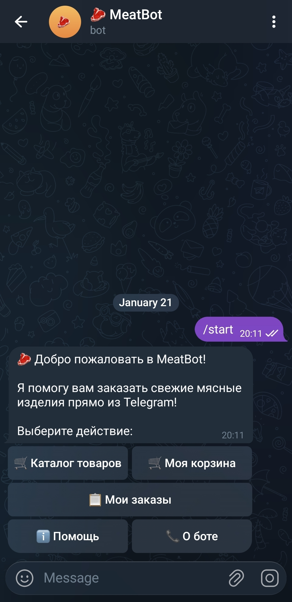
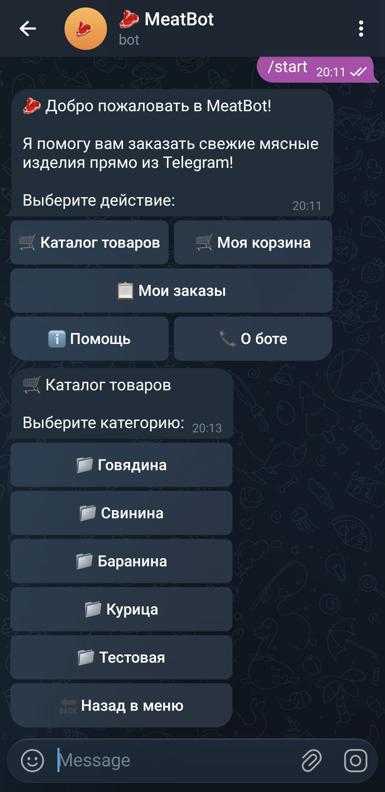
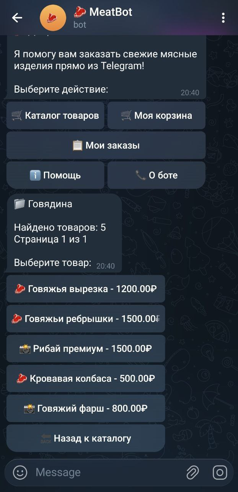
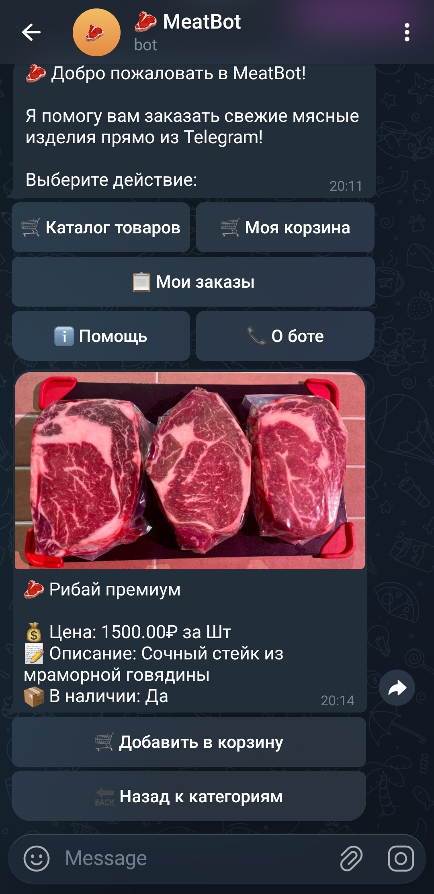
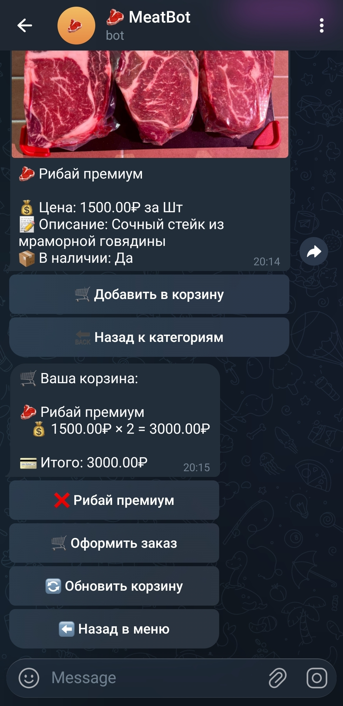
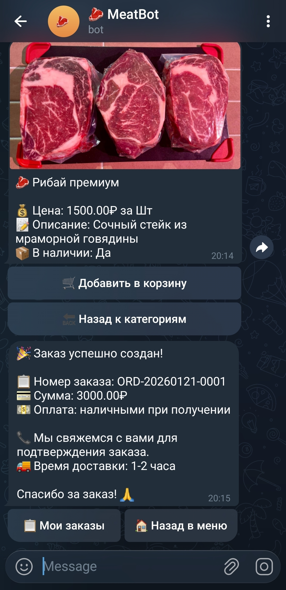
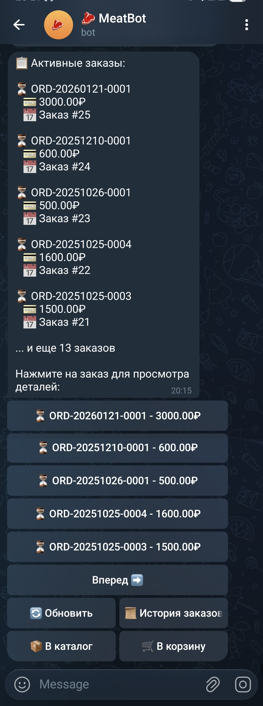
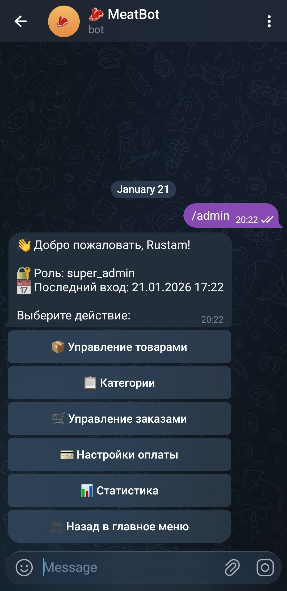

# 🥩 MeatBot - Telegram Bot для продажи мясных изделий

[](https://python.org)
[](https://aiogram.dev)
[](https://postgresql.org)
[](https://docker.com)
[](LICENSE)

Современный Telegram-бот для продажи мясных изделий с полным функционалом управления каталогом, корзиной и заказами.

## 🚀 Быстрый старт

### Предварительные требования
- Docker и Docker Compose
- Python 3.11+
- Telegram Bot Token

### Установка и запуск

1. **Клонирование репозитория**
```bash
git clone <repository-url>
cd MeatBot
```

2. **Настройка окружения**
```bash
cp .env.example .env
# Отредактируйте .env файл, добавив ваш BOT_TOKEN
```

3. **Запуск через Docker**
```bash
docker-compose up -d
```

4. **Выполнение миграций**
```bash
docker-compose exec app alembic upgrade head
```

5. **Добавление администратора**
```bash
# Запустите add_admin.bat или
python add_admin_postgres.py
```

## 📋 Основные функции

### Для пользователей
- 🛍️ **Каталог товаров** - просмотр категорий и товаров
- 🛒 **Корзина** - добавление, редактирование, удаление товаров
- 📦 **Заказы** - оформление и отслеживание заказов
- 🔍 **Поиск** - поиск товаров по названию
- 📸 **Изображения** - просмотр фотографий товаров

### Для администраторов
- 👨‍💼 **Админ панель** - полное управление системой
- 📚 **Каталог** - управление категориями и товарами
- 🖼️ **Изображения** - загрузка и управление фотографиями
- 📊 **Статистика** - просмотр аналитики и отчетов
- 👥 **Пользователи** - управление пользователями
- 🔐 **Роли** - система ролей (SUPER_ADMIN, ADMIN, MODERATOR)

## 📸 Скриншоты

### Главное меню


*Интуитивное главное меню с быстрым доступом ко всем функциям*

### Каталог товаров


*Удобный просмотр категорий товаров*

### Карточка товара


*Просмотр товаров, входящих в категорию*

### Корзина


*Детальная информация о товаре с фотографиями и характеристиками*

### Оформление заказа


*Просмотр и изменение товаров, добавленных в корзину*

### Подтверждение заказа


*Простой процесс оформления заказа*

### История заказов


*Просмотр и отслеживание всех заказов пользователя*

### Админ-панель


*Мощная панель администратора для управления системой*

---

## 🏗️ Архитектура

### Технологический стек
- **Backend:** Python 3.11+, aiogram 3.x, SQLAlchemy 2.0
- **База данных:** PostgreSQL 16 с Redis для кэширования
- **Инфраструктура:** Docker, Nginx, Celery
- **Обработка изображений:** Pillow с оптимизацией WebP

### Структура проекта
```
meatbot/
├── app/
│   ├── handlers/          # Обработчики команд бота
│   ├── database/          # Модели и миграции БД
│   ├── services/          # Бизнес-логика и сервисы
│   ├── keyboards/         # Клавиатуры Telegram
│   ├── middlewares/       # Middleware (admin, error handling)
│   ├── utils/            # Утилиты
│   └── config.py         # Конфигурация
├── docs/                 # Документация
├── static/               # Статические файлы
├── docker/               # Docker конфигурация
└── alembic/              # Миграции базы данных
```

## 🔧 Конфигурация

### Переменные окружения (.env)
```env
# Telegram Bot
BOT_TOKEN=your_bot_token_here

# База данных
DATABASE_URL=postgresql+psycopg://postgres:postgres@db:5432/meatbot
POSTGRES_PASSWORD=postgres

# Redis
REDIS_URL=redis://redis:6379/0

# Приложение
WEB_APP_PORT=8000
LOG_LEVEL=info
ENV=development
```

### Docker сервисы
- **meatbot-app** - основное приложение бота
- **meatbot-db** - PostgreSQL база данных
- **meatbot-redis** - Redis для кэширования
- **meatbot-nginx** - Nginx веб-сервер
- **meatbot-worker** - Celery worker для фоновых задач

## 📚 Документация

### Основные документы
- [📊 Статус проекта](docs/development/PROJECT_STATUS.md)
- [👨‍💼 Руководство администратора](docs/user-guides/ADMIN_PANEL_GUIDE.md)
- [🔧 Проблемы и исправления](docs/troubleshooting/ISSUES_AND_FIXES.md)
- [🗄️ Настройка базы данных](docs/user-guides/DATABASE_SETUP.md)

### Полная документация
См. [docs/README.md](docs/README.md) для полного индекса документации.

## 🚀 Развертывание

### Продакшен
1. Настройте переменные окружения для продакшена
2. Используйте `docker-compose.prod.yml`
3. Настройте SSL сертификаты
4. Настройте мониторинг и логирование

### Мониторинг
- Health checks: `http://localhost:8000/health/ready`
- Логи: `docker-compose logs -f app`
- Метрики: встроенные метрики приложения

## 🧪 Тестирование

### Запуск тестов
```bash
# Unit тесты
docker-compose exec app python -m pytest tests/unit/

# Integration тесты
docker-compose exec app python -m pytest tests/integration/

# Все тесты
docker-compose exec app python -m pytest
```

### Проверка качества кода
```bash
# Линтинг
docker-compose exec app flake8 meatbot/

# Форматирование
docker-compose exec app black meatbot/

# Проверка типов
docker-compose exec app mypy meatbot/
```

## 🔒 Безопасность

### Реализованные меры
- ✅ RBAC система с ролями администраторов
- ✅ Валидация всех входных данных
- ✅ Защита от SQL injection через SQLAlchemy
- ✅ Обработка ошибок и логирование
- ✅ Изоляция в Docker контейнерах

### Рекомендации
- Используйте HTTPS в продакшене
- Настройте rate limiting
- Регулярно обновляйте зависимости
- Мониторьте логи безопасности

## 📈 Производительность

### Оптимизации
- ✅ Индексы базы данных для быстрых запросов
- ✅ Redis кэширование каталога и сессий
- ✅ Connection pooling для PostgreSQL
- ✅ Оптимизация изображений (WebP формат)
- ✅ Асинхронная архитектура

### Метрики
- Время отклика API: < 200ms
- Загрузка каталога: < 1s
- Использование памяти: < 512MB

## 🤝 Разработка

### Установка для разработки
```bash
# Создание виртуального окружения
python -m venv venv
source venv/bin/activate  # Linux/Mac
# или
venv\Scripts\activate     # Windows

# Установка зависимостей
pip install -r requirements.txt
pip install -r requirements-dev.txt

# Настройка pre-commit hooks
pre-commit install
```

### Структура разработки
- **main** - основная ветка для продакшена
- **develop** - ветка для разработки
- **feature/*** - ветки для новых функций
- **hotfix/*** - ветки для критических исправлений

## 📞 Поддержка

### Получение помощи
1. Проверьте [документацию](docs/README.md)
2. Изучите [проблемы и исправления](docs/troubleshooting/ISSUES_AND_FIXES.md)
3. Создайте issue в репозитории

### Полезные команды
```bash
# Просмотр логов
docker-compose logs -f app

# Перезапуск сервисов
docker-compose restart

# Выполнение команд в контейнере
docker-compose exec app python -c "print('Hello from container')"

# Создание бэкапа БД
docker-compose exec db pg_dump -U postgres meatbot > backup.sql
```

## 📄 Лицензия

Все права защищены. Использование кода возможно только после приобретения лицензии.

Для получения коммерческой лицензии свяжитесь со мной:
- Email: rustam_zaripov@mail.com
- Telegram: @pasli_demir

## 🎯 Статус проекта

**Статус:** ✅ Готов к продакшену
**Версия:** 1.0.0
**Последнее обновление:** 20.01.2026

---

**Создано с ❤️ для эффективной продажи мясных изделий через Telegram**
